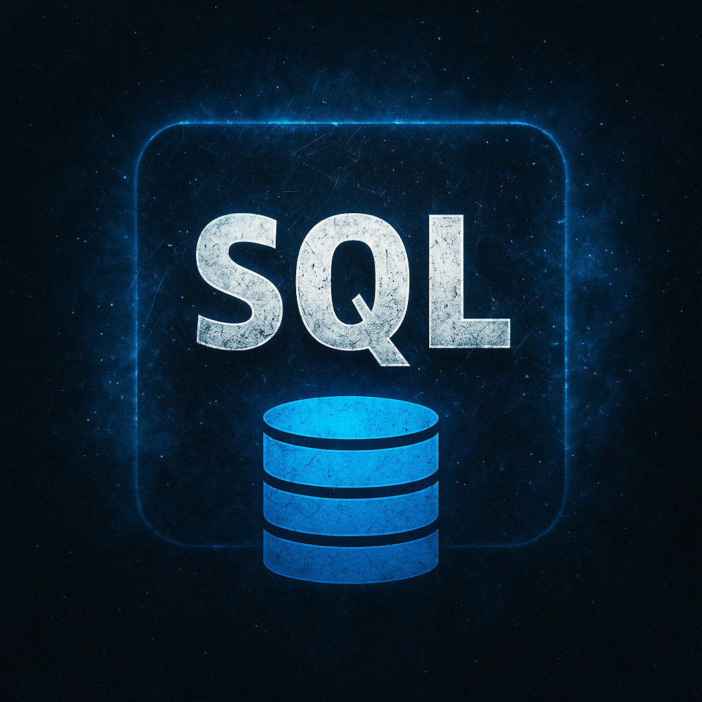

# SQLShell

<div align="center">



**A powerful SQL shell with GUI interface for data analysis**


</div>

## 🚀 Key Features

- **Interactive SQL Interface** - Rich syntax highlighting for enhanced query writing
- **DuckDB Integration** - Powerful analytical queries powered by DuckDB
- **Multi-Format Support** - Import and query Excel (.xlsx, .xls), CSV, and Parquet files effortlessly
- **Modern UI** - Clean, tabular results display with intuitive controls
- **Table Preview** - Quick view of imported data tables
- **Test Data Generation** - Built-in sample data for testing and learning
- **Multiple Views** - Support for multiple concurrent table views
- **Productivity Tools** - Streamlined workflow with keyboard shortcuts (e.g., Ctrl+Enter for query execution)

## 📦 Installation

### Using pip (Recommended)

```bash
pip install sqlshell
```

### Linux Setup with Virtual Environment

```bash
# Create and activate virtual environment
python3 -m venv ~/.venv/sqlshell
source ~/.venv/sqlshell/bin/activate

# Install SQLShell
pip install sqlshell

# Configure shell alias
echo 'alias sqls="~/.venv/sqlshell/bin/sqls"' >> ~/.bashrc  # or ~/.zshrc for Zsh
source ~/.bashrc  # or source ~/.zshrc
```

### Development Installation

```bash
git clone https://github.com/oyvinrog/SQLShell.git
cd SQLShell
pip install -e .
```

## 🎯 Getting Started

1. **Launch the Application**
   ```bash
   sqls
   ```

2. **Database Connection**
   - SQLShell automatically connects to a local DuckDB database named 'pool.db'

3. **Working with Data Files**
   - Click "Load Files" to select your Excel, CSV, or Parquet files
   - File contents are loaded as queryable SQL tables
   - Query using standard SQL syntax

4. **Query Execution**
   - Enter SQL in the editor
   - Execute using Ctrl+Enter or the "Execute" button
   - View results in the structured output panel

5. **Test Data**
   - Load sample test data using the "Test" button for quick experimentation

## 📝 Query Examples

### Basic Join Operation
```sql
SELECT *
FROM sample_sales_data cd
INNER JOIN product_catalog pc ON pc.productid = cd.productid
LIMIT 3;
```

### Multi-Statement Queries
```sql
-- Create a temporary view
CREATE OR REPLACE TEMPORARY VIEW test_v AS
SELECT *
FROM sample_sales_data cd
INNER JOIN product_catalog pc ON pc.productid = cd.productid;

-- Query the view
SELECT DISTINCT productid
FROM test_v;
```

## 💡 Pro Tips

- Use temporary views for complex query organization
- Leverage keyboard shortcuts for efficient workflow
- Explore the multi-format support for various data sources
- Create multiple tabs for parallel query development

## 📋 Requirements

- Python 3.8 or higher
- Dependencies (automatically installed):
  - PyQt6 ≥ 6.4.0
  - DuckDB ≥ 0.9.0
  - Pandas ≥ 2.0.0
  - NumPy ≥ 1.24.0
  - openpyxl ≥ 3.1.0 (Excel support)
  - pyarrow ≥ 14.0.1 (Parquet support)
  - fastparquet ≥ 2023.10.1 (Alternative parquet engine)
  - xlrd ≥ 2.0.1 (Support for older .xls files)

## 📄 License

This project is licensed under the MIT License - see the LICENSE file for details.
